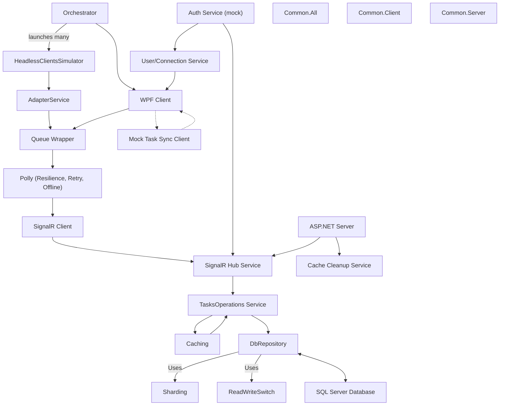

# ToDos Real-Time Collaborative App

## Table of Contents
1. [Project Summary](#project-summary)
2. [Demo / Screenshots](#demo--screenshots)
3. [Features](#features)
4. [Tech Stack](#tech-stack)
5. [Architecture Overview](#architecture-overview)
    - [Client Architecture](#client-architecture)
    - [Server Architecture](#server-architecture)
6. [Design Patterns & Principles](#design-patterns--principles)
7. [Scalability & Performance](#scalability--performance)
8. [Setup & Installation](#setup--installation)
9. [Usage](#usage)
10. [Project Structure](#project-structure)
11. [Key Implementation Notes / Tips & Tricks](#key-implementation-notes--tips--tricks)
    - [Level of "Mockiness" Used and Why](#level-of-mockiness-used-and-why)
12. [Testing](#testing)
13. [Extensibility & Future Improvements](#extensibility--future-improvements)

---

## Project Summary
A WPF + ASP.NET (SignalR) To-Do List application with real-time data synchronization. Multiple desktop clients connect and see updates instantly as tasks are added, edited, deleted, or locked for editing. The project focuses on robust architecture, real-time sync, and production-grade patterns.

---

## Demo / Screenshots
*(Add screenshots or a link to a video walkthrough here if available)*

---

## Features
- Add, edit, delete tasks (tasks are per user, supporting multi-user scenarios)
- Capable of serving multiple instances of the same user and multiple different users simultaneously, maintaining real-time synchronization and consistency across all clients
- Mark tasks as complete/incomplete
- Real-time updates across all clients (SignalR)
- Task locking to prevent simultaneous edits
- Task prioritization, tagging, and due dates
- MS SQL Server persistence (Entity Framework 6)
- Clean, MVVM-based WPF UI
- (Bonus) User authentication (mock or real, with automatic login in dev mode)
- (Bonus) UI state persistence

---

## Tech Stack
- **Client:** WPF (.NET Framework 4.8, XAML, MVVM)
- **Server:** ASP.NET (SignalR, .NET Framework 4.8)
- **Database:** MS SQL Server (Entity Framework 6)
- **Key Packages:**
  - CommunityToolkit.Mvvm
  - DotNetEnv
  - MaterialDesignColors, MaterialDesignThemes
  - Unity (DI)
  - AutoMapper
  - Serilog
  - Microsoft.AspNet.SignalR.Client
  - Polly

---

## Architecture Overview

### System Architecture Diagram


**Diagram Notes:**
- Orchestrator is at the top and can launch many UI clients and headless simulators.
- HeadlessClientsSimulator connects via AdapterService to the Queue Wrapper, simulating multiple clients.
- Auth Service (mock) is in the middle, communicating with both SignalR Hub Service and User/Connection Service (which talks to WPF Client).
- Caching is a feedback loop with the TasksOperations service.
- Sharding and ReadWriteSwitch are used by DbRepository as side services, with bidirectional communication to the SQL Server database.
- Polly provides resilience, retry logic, and offline queuing for the client.
- The server loads a Cache Cleanup Service for cache management.
- Shared/common projects are shown on the right for reference, with no direct lines for clarity.
- Mock and offline support, as well as multi-instance and multi-user capabilities, are supported as described in the documentation.

### Client Architecture
- **WPF Client (Todos.Client.Ui):**
  - Implements MVVM for separation of UI and logic.
  - Uses SignalR client for real-time communication.
  - Handles task CRUD, locking, and UI state.
  - Supports tagging, prioritization, and due dates.
  - Uses dependency injection (Unity) for service management.
  - UI built with Material Design for WPF.
  - **Advanced Filtering:**
    - The UI supports advanced filtering of tasks by tag, user, completion status, and other criteria, allowing users to focus on relevant tasks.
  - **Task Locking, Editing, Adding, Deleting:**
    - When a user begins editing a task, the client requests a lock from the server to prevent simultaneous edits by other users. The lock is released when editing is finished or the user disconnects.
    - Adding, editing, and deleting tasks are performed via SignalR calls to the server, which then broadcasts updates to all connected clients in real time.
    - The UI reflects task state changes instantly, including lock status, completion, and updates from other users.
  - **User Connection Management:**
    - The client maintains a persistent connection to the server via SignalR, with connection state reflected in the UI.
    - User identity and presence are managed using JWT tokens (mocked in dev mode), and the connection ID is used to track and manage user sessions.
    - On disconnect or exit, the client ensures that any held task locks are released (unlock on exit), and the UI updates to reflect connection status.
  - **Offline/Mock Support:**
    - Can use a mock task sync client for offline scenarios or testing.
    - Includes a queue for offline operation and persistence, ensuring actions are reliably sent to the server when reconnected.
    - UI state persistence for user experience.
  - **Multi-Instance & Multi-User Support:**
    - The system supports running multiple instances for the same user as well as for different users, all kept in sync in real time.

- **Client Common (Todos.Client.Common):**
  - Defines interfaces (e.g., `ITaskSyncClient`) and shared DTOs/models.
  - Enables decoupling between UI and sync implementations.

- **Client Simulators (Todos.ClientSimsY, ToDos.Clients.Simulator, etc.):**
  - Used for load testing, simulating multiple clients, and edge case validation.
  - Use HashSet for efficient task tracking.

### Server Architecture
- **ASP.NET Server (Todos.TaskSyncServer):**
  - Exposes SignalR hub for all client communication (no REST endpoints).
  - Handles CRUD, task locking, and real-time broadcasting.
  - Uses Entity Framework 6 for data access and SQL Server persistence.
  - Implements repository pattern for data abstraction.
  - Uses AutoMapper for mapping between DB entities and DTOs.
  - Supports sharding and CQRS-style read/write separation for scalability.
  - Exception handling and structured logging (Serilog).

- **Server Common (ToDos.Server.Common):**
  - Shared DTOs, entities, and interfaces for cross-project consistency.

- **DbReplication/DbSharding:**
  - Support for sharding and replication to improve scalability and reliability.

---

## Design Patterns & Principles
- **MVVM:** For WPF client structure and testability.
- **Repository Pattern:** For data access abstraction on the server.
- **Pub/Sub (SignalR):** For real-time updates and event broadcasting.
- **Dependency Injection (Unity):** For managing object lifetimes and dependencies, and enabling easy swapping between mock and real implementations for testing.
- **Automapper:** For mapping between models, DTOs, and entities.
- **CQRS-style Separation:** For scalable read/write operations.
- **Thread Safety:** Locks and concurrent collections for multi-client scenarios.

---

## Scalability & Performance
- **Queues:** Buffer write load under stress (throttling).
- **Sharding:** Distributes data for scalability.
- **CQRS:** Read/write separation for performance.
- **ConfigureAwait(false):** Frees up threads in async code.
- **ThreadPool Tuning:** Uses `SetMinThreads(...)` for optimal concurrency.
- **Caching:** Reduces DB load and improves response times.
- **Broadcast Filtering:** Server filters updates to relevant clients.
- **Exception Handling:** Try/catch for edge cases, especially in broadcast and sync logic.

---

## Setup & Installation
1. **Prerequisites:**
   - .NET Framework 4.8
   - MS SQL Server (installed and running locally)
2. **Clone the repository**
3. **Restore NuGet packages**
4. **Configure SQL Server connection string:**
   - Edit `.env.repository` or `App.config`/`Web.config` to point to your SQL Server instance.
   - Example:
     ```xml
     <connectionStrings>
       <add name="TaskDbContext" connectionString="Data Source=YOUR_SERVER;Initial Catalog=ToDosDb;Integrated Security=True;" providerName="System.Data.SqlClient" />
     </connectionStrings>
     ```
5. **Build and run the server**
6. **Build and run one or more WPF clients**
7. **The database and test data will be created automatically on first run using a mock factory.**

---

## Usage
- **Start the server** (Todos.TaskSyncServer)
- **Start one or more clients** (Todos.Client.Ui)
- **Login (if authentication enabled)**
- **Add, edit, delete, and complete tasks**
- **Observe real-time updates across all clients**

---

## Project Structure
- **Client/**
  - `Todos.Client.Ui`: Main WPF client app (MVVM, SignalR, Material Design)
  - `Todos.Client.Common`: Shared interfaces, DTOs, and models
  - `Todos.ClientSimsY`, `ToDos.Clients.Simulator`: Simulators for load and concurrency testing
  - `Todos.Client.MockTaskSyncClient`: Mock implementation for offline/testing
  - `Todos.Client.UserService`: User authentication (mock/real)
  - `Orchestrator`: Manages and coordinates multiple simulated client instances, allowing for stress-testing and scenario automation. Can be used to launch and control many client instances for concurrency and robustness testing.
- **Server/**
  - `Todos.TaskSyncServer`: ASP.NET SignalR server
  - `ToDos.Server.Common`: Shared DTOs, entities, interfaces
  - `ToDos.Repository`: Data access layer (EF, repository pattern)
  - `DbReplication`, `DbSharding`: Advanced scalability features
- **Common/**
  - Shared caching, logging, and utility libraries

---

## Key Implementation Notes / Tips & Tricks
- **Connection ID:** Used to uniquely identify and manage client connections.
- **NoSelectOnClickBehavior:** Custom WPF behavior to improve UX.
- **Clear Focus:** Utility to clear focus from controls programmatically.
- **Unlock on Exit:** The client ensures that any held task locks are released when the user disconnects or exits, preventing stale locks and ensuring smooth collaboration for all users.
- **Use of HashSet in Sim Clients:** Efficiently tracks tasks in simulators.
- **Shared Methods/Classes/Enums:** Common projects expose types for cross-assembly use (e.g., LogFactory).
- **Broadcast Filtering:** The server filters which clients receive which updates, and clients further filter the received data before displaying it (e.g., by tag, user, or other criteria).
- **Client-Side Filtering:** After receiving broadcasted updates, clients apply additional filtering (e.g., by tag, user, or other criteria) before displaying data in the UI.
- **Queue for Offline/Persistence:** The client uses a queue to buffer actions while offline and ensure persistence, so changes are reliably sent to the server when reconnected.
- **IDs:** `userId` and `taskId` are created on the server as integers; `tagId` is created on the client as a GUID.
- **Edge Case Handling:** Try/catch blocks around critical sync and broadcast logic.
- **JWT Authentication:** The SignalR Hub implements JWT authentication (`jjwtauthenticate`), which is mostly mocked for demonstration and testing purposes, fulfilling the bonus authentication requirement.
- **Automatic Login in Dev Mode:** In current development mode, login is performed automatically using a demo user or via orchestrator overload, simplifying testing and demonstration.
- **Dependency Injection for Testing:** The use of DI (Unity) allows for easy swapping between mock and real implementations, supporting spot testing and unit testing throughout the codebase.

### Level of "Mockiness" Used and Why
- **Mock Authentication:** Used to simplify setup and focus on real-time sync logic. Can be replaced with real auth if needed.
- **Mock Task Sync Client:** Allows for offline testing, simulating network failures, and rapid development.
- **Semi-Mocked Sharding and CQRS:** Sharding and CQRS-style read/write separation are implemented in a semi-mocked fashion to demonstrate architectural patterns and enable easy extension to real distributed or production-grade implementations.
- **Real Implementations:** Used for core CRUD and SignalR communication.
- **Rationale:** Enables rapid development, easier testing, and demonstration of architecture flexibility. Mocks are clearly separated and swappable.

---

## Testing
- Unit tests for core logic in both client and server (see `*.Tests` projects).
- Simulators for load and concurrency testing.
- To run tests: open solution in Visual Studio, build, and run tests via Test Explorer.
- **Multi-client/system testing:** Use Visual Studio's multi-startup profiles to launch both the server and orchestrator, simulating many clients. Alternatively, launch both executables manually to observe real-time sync and concurrency behavior.

---

## Extensibility & Future Improvements
- Easy to extend with new features (e.g., advanced filtering, notifications).
- Real authentication and authorization.

---

## Highlights
- **Comprehensive Feature Set & Scalability:** The codebase is large because it implements a wide range of features (real-time sync, locking, tagging, filtering, authentication, offline support, etc.), and is architected for scalability and extensibility.
- **Separation for Testability & Maintainability:** Strong separation of concerns is maintained throughout the solution, with clear boundaries between client, server, and common projects. Coding files (logic, view models, services) are structurally separated from XAML/UI files, ensuring maintainability, clarity, and ease of testing.
- **Production-Grade Patterns:** The project uses production-grade design patterns (MVVM, Repository, Pub/Sub, DI, CQRS, etc.) and robust error handling, not just “getting it working.”
- **Zero Warnings:** The solution builds with zero warnings and near-zero messages, reflecting a high standard of code quality.
- **Adaptability:** While this project demonstrates a full-featured, scalable architecture, the same principles can be applied to deliver smaller, focused solutions as needed. 