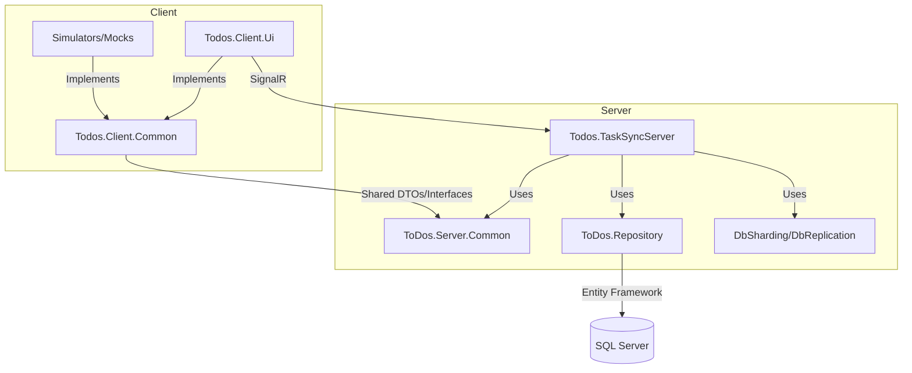

# ToDos Real-Time Collaborative App

## Table of Contents
1. [Project Summary](#project-summary)
2. [Demo / Screenshots](#demo--screenshots)
3. [Features](#features)
4. [Tech Stack](#tech-stack)
5. [Architecture Overview](#architecture-overview)
    - [Client Architecture](#client-architecture)
    - [Server Architecture](#server-architecture)
    - [Relationships Between Layers/Projects/Interfaces](#relationships-between-layersprojectsinterfaces)
6. [Design Patterns & Principles](#design-patterns--principles)
7. [Scalability & Performance](#scalability--performance)
8. [Setup & Installation](#setup--installation)
9. [Usage](#usage)
10. [Project Structure](#project-structure)
11. [Key Implementation Notes / Tips & Tricks](#key-implementation-notes--tips--tricks)
    - [Level of "Mockiness" Used and Why](#level-of-mockiness-used-and-why)
12. [Testing](#testing)
13. [Extensibility & Future Improvements](#extensibility--future-improvements)
14. [License](#license)
15. [Contact / Acknowledgements](#contact--acknowledgements)

---

## Project Summary
A WPF + ASP.NET (SignalR) To-Do List application with real-time data synchronization. Multiple desktop clients connect and see updates instantly as tasks are added, edited, deleted, or locked for editing. Built for the CityShob C# full-stack developer interview homework, focusing on robust architecture, real-time sync, and production-grade patterns.

---

## Demo / Screenshots
*(Add screenshots or a link to a video walkthrough here if available)*

---

## Features
- Add, edit, delete tasks
- Mark tasks as complete/incomplete
- Real-time updates across all clients (SignalR)
- Task locking to prevent simultaneous edits
- Task prioritization, tagging, and due dates
- MS SQL Server persistence (Entity Framework 6)
- Clean, MVVM-based WPF UI
- (Bonus) User authentication (mock or real)
- (Bonus) UI state persistence

---

## Tech Stack
- **Client:** WPF (.NET Framework 4.8, MVVM)
- **Server:** ASP.NET (SignalR, .NET Framework 4.8)
- **Database:** MS SQL Server (Entity Framework 6)
- **Key Packages:**
  - CommunityToolkit.Mvvm
  - DotNetEnv
  - MaterialDesignColors, MaterialDesignThemes
  - Unity (DI)
  - AutoMapper
  - Serilog
  - Microsoft.AspNet.SignalR.Client
  - Polly

---

## Architecture Overview

### System Architecture Diagram
```mermaid
flowchart LR
    A[WPF Client (Todos.Client.Ui)] -- SignalR --> B[ASP.NET Server (Todos.TaskSyncServer)]
    B -- Entity Framework --> C[(SQL Server Database)]
    A -- Uses --> D[Client Common (Todos.Client.Common)]
    B -- Uses --> E[Server Common (ToDos.Server.Common)]
    D -- Shared DTOs/Interfaces --> E
    A -.-> F[Mock/Sim Clients]
```

### Client Architecture
- **WPF Client (Todos.Client.Ui):**
  - Implements MVVM for separation of UI and logic.
  - Uses SignalR client for real-time communication.
  - Handles task CRUD, locking, and UI state.
  - Supports tagging, prioritization, and due dates.
  - Uses dependency injection (Unity) for service management.
  - UI built with Material Design for WPF.
  - **Offline/Mock Support:**
    - Can use a mock task sync client for offline scenarios or testing.
    - UI state persistence for user experience.

- **Client Common (Todos.Client.Common):**
  - Defines interfaces (e.g., `ITaskSyncClient`) and shared DTOs/models.
  - Enables decoupling between UI and sync implementations.

- **Client Simulators (Todos.ClientSimsY, ToDos.Clients.Simulator, etc.):**
  - Used for load testing, simulating multiple clients, and edge case validation.
  - Use HashSet for efficient task tracking.

### Server Architecture
- **ASP.NET Server (Todos.TaskSyncServer):**
  - Exposes SignalR hub for all client communication (no REST endpoints).
  - Handles CRUD, task locking, and real-time broadcasting.
  - Uses Entity Framework 6 for data access and SQL Server persistence.
  - Implements repository pattern for data abstraction.
  - Uses AutoMapper for mapping between DB entities and DTOs.
  - Supports sharding and CQRS-style read/write separation for scalability.
  - Exception handling and structured logging (Serilog).

- **Server Common (ToDos.Server.Common):**
  - Shared DTOs, entities, and interfaces for cross-project consistency.

- **DbReplication/DbSharding:**
  - Support for sharding and replication to improve scalability and reliability.

### Relationships Between Layers/Projects/Interfaces



---

## Design Patterns & Principles
- **MVVM:** For WPF client structure and testability.
- **Repository Pattern:** For data access abstraction on the server.
- **Pub/Sub (SignalR):** For real-time updates and event broadcasting.
- **Dependency Injection (Unity):** For managing object lifetimes and dependencies.
- **Automapper:** For mapping between models, DTOs, and entities.
- **CQRS-style Separation:** For scalable read/write operations.
- **Thread Safety:** Locks and concurrent collections for multi-client scenarios.

---

## Scalability & Performance
- **Queues:** Buffer write load under stress (throttling).
- **Sharding:** Distributes data for scalability.
- **CQRS:** Read/write separation for performance.
- **ConfigureAwait(false):** Frees up threads in async code.
- **ThreadPool Tuning:** Uses `SetMinThreads(...)` for optimal concurrency.
- **Caching:** Reduces DB load and improves response times.
- **Broadcast Filtering:** Server filters updates to relevant clients.
- **Exception Handling:** Try/catch for edge cases, especially in broadcast and sync logic.

---

## Setup & Installation
1. **Prerequisites:**
   - .NET Framework 4.8
   - MS SQL Server (installed and running locally)
2. **Clone the repository**
3. **Restore NuGet packages**
4. **Configure SQL Server connection string:**
   - Edit `.env.repository` or `App.config`/`Web.config` to point to your SQL Server instance.
   - Example:
     ```xml
     <connectionStrings>
       <add name="TaskDbContext" connectionString="Data Source=YOUR_SERVER;Initial Catalog=ToDosDb;Integrated Security=True;" providerName="System.Data.SqlClient" />
     </connectionStrings>
     ```
5. **Run Entity Framework migrations** (if applicable) to create the database.
6. **Build and run the server**
7. **Build and run one or more WPF clients**
8. **The database will be created automatically on first run.**

---

## Usage
- **Start the server** (Todos.TaskSyncServer)
- **Start one or more clients** (Todos.Client.Ui)
- **Login (if authentication enabled)**
- **Add, edit, delete, and complete tasks**
- **Observe real-time updates across all clients**

---

## Project Structure
- **Client/**
  - `Todos.Client.Ui`: Main WPF client app (MVVM, SignalR, Material Design)
  - `Todos.Client.Common`: Shared interfaces, DTOs, and models
  - `Todos.ClientSimsY`, `ToDos.Clients.Simulator`: Simulators for load and concurrency testing
  - `Todos.Client.MockTaskSyncClient`: Mock implementation for offline/testing
  - `Todos.Client.UserService`: User authentication (mock/real)
- **Server/**
  - `Todos.TaskSyncServer`: ASP.NET SignalR server
  - `ToDos.Server.Common`: Shared DTOs, entities, interfaces
  - `ToDos.Repository`: Data access layer (EF, repository pattern)
  - `DbReplication`, `DbSharding`: Advanced scalability features
- **Common/**
  - Shared caching, logging, and utility libraries

---

## Key Implementation Notes / Tips & Tricks
- **Connection ID:** Used to uniquely identify and manage client connections.
- **NoSelectOnClickBehavior:** Custom WPF behavior to improve UX.
- **Clear Focus:** Utility to clear focus from controls programmatically.
- **Unlock on Exit:** Ensures tasks are unlocked if a client disconnects.
- **Use of HashSet in Sim Clients:** Efficiently tracks tasks in simulators.
- **Shared Methods/Classes/Enums:** Common projects expose types for cross-assembly use (e.g., LogFactory).
- **Broadcast Filtering:** Server filters which clients receive which updates.
- **Edge Case Handling:** Try/catch blocks around critical sync and broadcast logic.

### Level of "Mockiness" Used and Why
- **Mock Authentication:** Used to simplify setup and focus on real-time sync logic. Can be replaced with real auth if needed.
- **Mock Task Sync Client:** Allows for offline testing, simulating network failures, and rapid development.
- **Real Implementations:** Used for core CRUD and SignalR communication.
- **Rationale:** Enables rapid development, easier testing, and demonstration of architecture flexibility. Mocks are clearly separated and swappable.

---

## Testing
- Unit tests for core logic in both client and server (see `*.Tests` projects).
- Simulators for load and concurrency testing.
- To run tests: open solution in Visual Studio, build, and run tests via Test Explorer.

---

## Extensibility & Future Improvements
- Easy to extend with new features (e.g., advanced filtering, notifications).
- Real authentication and authorization.
- More granular permissions and audit logging.
- Web client or mobile app.
- Cloud deployment and scaling.

---

## License
MIT (or specify your license)

---

## Contact / Acknowledgements
- Developed as part of CityShob C# full-stack developer interview homework.
- For questions, contact [Your Name/Email]. 