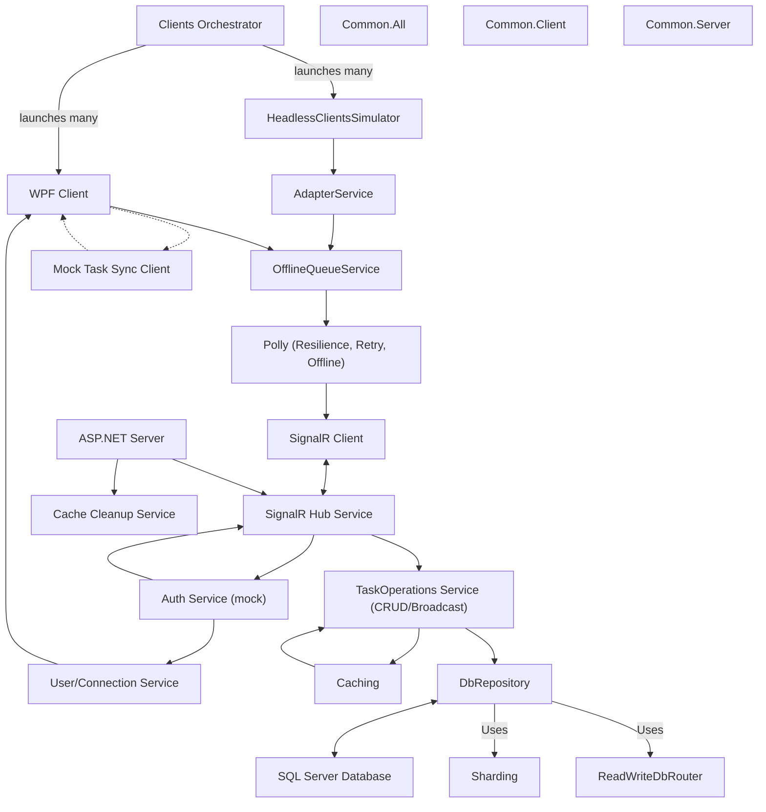

# ToDos Real-Time Collaborative App

## Table of Contents
1. [Project Summary](#project-summary)
2. [Demo / Screenshots](#demo--screenshots)
3. [Features](#features)
4. [Tech Stack](#tech-stack)
5. [Architecture Overview](#architecture-overview)
    - [Client Architecture](#client-architecture)
    - [Server Architecture](#server-architecture)
6. [Design Patterns & Principles](#design-patterns--principles)
7. [Scalability & Performance](#scalability--performance)
8. [Setup & Installation](#setup--installation)
9. [Usage](#usage)
10. [Project Structure](#project-structure)
11. [Key Implementation Notes / Tips & Tricks](#key-implementation-notes--tips--tricks)
    - [Level of "Mockiness" Used and Why](#level-of-mockiness-used-and-why)
12. [Testing](#testing)
13. [Extensibility & Future Improvements](#extensibility--future-improvements)

---

## Project Summary
A WPF + ASP.NET (SignalR) To-Do List application with real-time data synchronization. Multiple desktop clients connect and see updates instantly as tasks are added, edited, deleted, or locked for editing. The project focuses on robust architecture, real-time sync, and production-grade patterns.

---

## Demo / Screenshots
*(Add screenshots or a link to a video walkthrough here if available)*

---

## Features
- Add, edit, delete tasks (per user, supports multi-user and multi-instance scenarios)
- Real-time updates and task locking (SignalR)
- Advanced filtering (by tag, user, status) both server-side and, where needed, client-side
- Task prioritization, tagging, and due dates
- Offline support with queue and retry
- Orchestrator for launching multiple clients/client simulators and running multi-layered/manual/automated tests, with a combined logs viewer and filtering
- UI state persistence
- Mock/real authentication

---

## Tech Stack
- **Client:** WPF (.NET Framework 4.8, XAML, MVVM)
- **Server:** ASP.NET (SignalR, .NET Framework 4.8)
- **Database:** MS SQL Server (Entity Framework 6)
- **Key Packages:**
  - CommunityToolkit.Mvvm
  - DotNetEnv
  - MaterialDesignColors, MaterialDesignThemes
  - Unity (DI)
  - AutoMapper
  - Serilog
  - Microsoft.AspNet.SignalR.Client
  - Polly

---

## Architecture Overview

### System Architecture Diagram


### Client Architecture
- **WPF Client (Todos.Client.Ui):**
  - Implements MVVM for separation of UI and logic.
  - Uses SignalR client for real-time communication.
  - Handles task CRUD, locking, and UI state.
  - Supports tagging, prioritization, and due dates.
  - Uses dependency injection (Unity) for service management.
  - UI built with Material Design for WPF.
  - **Advanced Filtering:**
    - The UI supports advanced filtering of tasks by tag, user, completion status, and other criteria, allowing users to focus on relevant tasks.
    - Filtering is performed both on the server (broadcast filtering) and on the client (due to SignalR limitations, some filtering—such as by tag or user—may be done client-side after receiving updates).
  - **Task Locking, Editing, Adding, Deleting:**
    - When a user begins editing a task, the client requests a lock from the server to prevent simultaneous edits by other users. The lock is released when editing is finished or the user disconnects.
    - Adding, editing, and deleting tasks are performed via SignalR calls to the server, which then broadcasts updates to all connected clients in real time.
    - The UI reflects task state changes instantly, including lock status, completion, and updates from other users.
  - **User Connection Management:**
    - The client maintains a persistent connection to the server via SignalR, with connection state reflected in the UI.
    - User identity and presence are managed using JWT tokens (mocked in dev mode), and <u>the connection ID is used to track and manage user sessions</u>.
    - On disconnect or exit, the client ensures that any held task locks are released (unlock on exit), and the UI updates to reflect connection status.
  - **Offline/Mock Support:**
    - Can use a mock task sync client for offline scenarios or testing.
    - Includes a queue for offline operation and persistence, ensuring actions are reliably sent to the server when reconnected.
    - UI state persistence for user experience.
- **Orchestrator (Todos.Client.Orchestrator):**
  - Acts as a controller for launching and managing multiple simulated client instances.
  - Coordinates actions across clients to simulate real-world usage, concurrency, and edge cases.
  - Essential for stress-testing, scenario automation, and demonstrating system robustness under load.
  - **Multi-Instance & Multi-User Support:**
    - The system supports running multiple instances for the same user as well as for different users, all kept in sync in real time.
  - **Combined Logs Viewer:**
    - Orchestrator provides a combined logs viewer for all clients it launches, with filtering options by process ID, live status, and client type.

### Server Architecture
- **ASP.NET Server (Todos.TaskSyncServer):**
  - Exposes SignalR hub for all client communication (no REST endpoints).
  - Handles CRUD, task locking, and real-time broadcasting.
  - Uses Entity Framework 6 for data access and SQL Server persistence.
  - Implements repository pattern for data abstraction.
  - Uses AutoMapper for mapping between DB entities and DTOs.
  - Supports sharding and CQRS-style read/write separation for scalability.
  - Exception handling and structured logging (Serilog).

- **Server Common (ToDos.Server.Common):**
  - Shared DTOs, entities, and interfaces for cross-project consistency.

- **DbReplication/DbSharding:**
  - Support for sharding and replication to improve scalability and reliability.

---

## Design Patterns & Principles
- MVVM, Repository, Pub/Sub (SignalR), Dependency Injection (Unity), Automapper (entity <-> DTO <-> model), CQRS-style separation, Thread safety
- All major access points and services are interface-driven for testability, flexibility, and easy extension

---

## Scalability & Performance
- **Queues:** Buffer write load under stress (throttling).
- **Sharding:** Distributes data for scalability.
- **CQRS:** Read/write separation for performance.
- **ConfigureAwait(false):** Frees up threads in async code.
- **ThreadPool Tuning:** Uses `SetMinThreads(...)` for optimal concurrency.
- **Caching:** Reduces DB load and improves response times.
- **Broadcast Filtering:** Server filters updates to relevant clients.
- **Exception Handling:** Try/catch for edge cases, especially in broadcast and sync logic.

---

## Setup & Installation
1. **Prerequisites:**
   - .NET Framework 4.8
   - MS SQL Server (installed and running locally)
2. **Clone the repository**
3. **Restore NuGet packages**
4. **Configure SQL Server connection string:**
   - Edit `.env.repository` to point to your SQL Server instance. Sharding and read/write separation are turned off by default; you only need to adjust the server name.
   - Example:
     ```
     MSSQL_TRUSTED_CONNECTION_STRING=Server=NOVPC;Database=db1;Trusted_Connection=True;TrustServerCertificate=True;
     ```
5. **Build and run the server**
6. **Build and run one or more WPF clients**
7. **The database and test data will be created automatically on first run using a mock factory.**

---

## Usage
- **Start the server** (Todos.TaskSyncServer)
- **Start one or more clients** (Todos.Client.Ui)
- **Login (if authentication enabled)**
- **Add, edit, delete, and complete tasks**
- **Observe real-time updates across all clients**

---

## Project Structure
- **Client/**
  - `Todos.Client.Ui`: Main WPF client app (MVVM, SignalR, Material Design)
  - `Todos.Client.Common`: Shared interfaces, DTOs, and models
  - `Todos.ClientSimsY`, `ToDos.Clients.Simulator`: Simulators for load and concurrency testing
  - `Todos.Client.MockTaskSyncClient`: Mock implementation for offline/testing
  - `Todos.Client.UserService`: User authentication (mock/real)
  - `Orchestrator`: Manages and coordinates multiple simulated client instances, allowing for stress-testing and scenario automation. Can be used to launch and control many client instances for concurrency and robustness testing.
- **Server/**
  - `Todos.TaskSyncServer`: ASP.NET SignalR server
  - `ToDos.Server.Common`: Shared DTOs, entities, interfaces
  - `ToDos.Repository`: Data access layer (EF, repository pattern)
  - `DbReplication`, `DbSharding`: Advanced scalability features
- **Common/**
  - Shared caching, logging, and utility libraries

---

## Key Implementation Notes / Tips & Tricks
- **Filtering:** Server filters which clients receive updates; client may filter further by connectionId due to SignalR limitations.
- **Caching:** Server-side caching accelerates reads and reduces DB load, improving performance for all clients.
- **IDs:** `userId` and `taskId` are server-side auto-incrementing integers; `tagId` is a client-side GUID for uniqueness before sync.
- **Error Handling/Logging:** Structured logging (Serilog) is used throughout; errors are surfaced in logs and, where relevant, in the UI.
- **Unlock on Exit:** Clients release any held task locks on disconnect/exit to prevent stale locks.
- **DI/Interfaces:** All access points and services are interface-driven and use DI (Unity) for testability and flexibility.
- **Thread Safety/Concurrency:** TaskRepository is operation-scoped for thread safety; UI updates from background events are marshaled to the UI thread for responsiveness.
- **Offline Queue:** Buffers actions for persistence/retry, ensuring reliable sync after reconnect.
- **JWT Auth:** Mocked for demo/testing, but structure allows for real implementation.
- **WPF UX:** NoSelectOnClickBehavior & Clear Focus prevent unwanted selection/focus and improve user experience.

### Level of "Mockiness" Used and Why
- **Mock Authentication:** Used to simplify setup and focus on real-time sync logic. Can be replaced with real auth if needed.
- **Mock Task Sync Client:** Allows for offline testing, simulating network failures, and rapid development.
- **Semi-Mocked Sharding and CQRS:** Sharding and CQRS-style read/write separation are implemented in a semi-mocked fashion to demonstrate architectural patterns and enable easy extension to real distributed or production-grade implementations.
- **Caching and Cache Cleanup Services (Real):** Caching and cache cleanup are implemented as real services for performance optimization and resource management.
- **Real Implementations:** Used for core CRUD and SignalR communication.
- **Rationale:** Enables rapid development, easier testing, and demonstration of architecture flexibility. Mocks are clearly separated and swappable.

---

## Testing
- Unit tests (MSTest) for core logic in both client and server
- Orchestrator enables manual and structured testing by launching multiple clients and providing a combined logs viewer with filtering
- Simulator supports template-based task execution (script files with task lists) for repeatable, automated scenario testing
- Multi-client/system testing via Visual Studio multi-startup profiles or manual launch

---

## Extensibility & Future Improvements
- Layered, interface-driven architecture makes it easy to add new features, layers, or services
- Easy to extend with new features (e.g., advanced filtering, notifications)
- Real authentication and authorization
- On permanent disconnect, prompt UI to notify the user or allow manual retry
- Use a timer or debounce logic to prevent multiple rapid calls
- Add visual indication of offline queued tasks and their resolution

---

## Highlights
- Large codebase due to features, separation, testability, scalability
- Production-grade patterns, zero warnings, adaptable for smaller solutions 

## Requirements & Implementation Status

- [x] Real-time updates via SignalR (no REST endpoints)
- [x] Task locking for concurrent editing
- [x] Advanced filtering and tagging
- [x] Due dates for tasks
- [x] Multi-user and multi-instance support
- [x] Server-side and client-side filtering (with connectionId logic)
- [x] Offline support with queue and retry logic (Polly)
- [x] Caching and cache cleanup for performance
- [x] Mocked JWT authentication (auto-login in dev)
- [x] Server-side auto-incrementing IDs (userId, taskId); client-side GUIDs for tagId
- [x] Orchestrator for launching multiple clients, running tests, and log viewing
- [x] Structured logging (Serilog) with error surfacing in logs and UI
- [x] Unlock on exit (release locks on disconnect/exit)
- [x] Interface-driven, DI (Unity) for all access points/services
- [x] Thread safety (operation-scoped TaskRepository, UI thread marshaling)
- [x] Automapper for entity <-> DTO <-> model mapping
- [x] WPF UX improvements (NoSelectOnClickBehavior, Clear Focus)
- [x] Unit tests (MSTest), orchestrator/manual/structured testing, simulator for multi-client/system testing
- [x] Extensible, layered, interface-driven architecture
- [x] Future improvements listed (UI notification/manual retry, debounce, offline queue indication) 